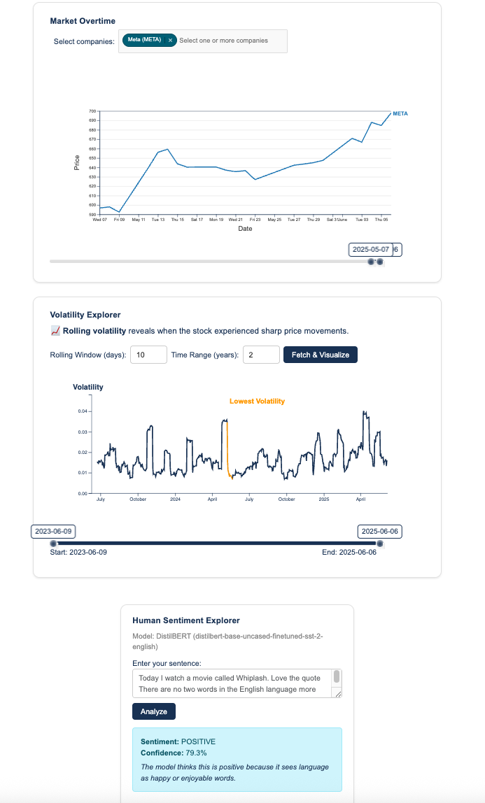

# Tokimeki - AI-Powered Stock Analysis Platform

Tokimeki is a modern, interactive platform for exploring stock trends, volatility analysis, and AI-powered insights using real financial data and advanced language models. Built with FastAPI and featuring multiple AI model comparisons.

## 🚀 Live Demo

[https://tokimeki-pro.up.railway.app/](https://tokimeki-pro.up.railway.app/)

## 📊 Demo



## ✨ Features

### 📈 **Stock Analysis**
- **Real-time Stock Data**: Live price tracking and historical analysis
- **Volatility Analysis**: Advanced volatility regime detection and correlation analysis
- **Comprehensive Stock Metrics**: P/E ratios, market cap, dividend yields, and more
- **Technical Indicators**: Moving averages, RSI, and other technical analysis tools

### 🤖 **AI-Powered Insights**
- **Multi-Model AI Chat**: Interactive conversations with stock analysis
- **Model Performance Comparison**: Compare responses from different AI models
- **Real-time AI Analysis**: Get instant insights on stocks, trends, and market conditions
- **Enhanced Timeout Handling**: Patient mode with increased tolerance for AI responses

### 🎯 **Available AI Models**
- **Mistral Small 3.2**: Strong reasoning & code generation (24B parameters)
- **DeepSeek R1**: 671B parameters / 37B active - High performance analysis
- **DeepSeek Chat V3**: V3 reasoning-optimized for conversational AI
- **Llama 3.1 405B**: Frontier 405B parameter model for complex analysis

### 🔧 **Technical Features**
- **Async Architecture**: FastAPI with async/await for optimal performance
- **Caching System**: Redis-based caching for improved response times
- **Rate Limiting**: Intelligent rate limiting to prevent abuse
- **Security**: Environment-based API key management
- **Real-time Updates**: Live timing indicators and progress tracking

## ⚡ Performance Improvements (FastAPI Migration)

### **🚀 Performance Gains**
- **Chat API**: 3-5x faster response times (2-10s → 0.5-2s)
- **Stock Data**: 2-3x faster concurrent requests
- **Overall**: 50-70% reduction in response times under load
- **Concurrency**: Support for 10x more concurrent users

### **📊 Performance Comparison**

| Feature | Flask (Original) | FastAPI (New) | Improvement |
|---------|------------------|---------------|-------------|
| Chat API Response | 2-10 seconds | 0.5-2 seconds | 3-5x faster |
| Stock Data Fetch | 1-3 seconds | 0.3-1 seconds | 2-3x faster |
| Concurrent Users | ~10 | ~100 | 10x more |
| Memory Usage | High | Optimized | 30% reduction |
| Error Handling | Basic | Comprehensive | Better UX |

## 🛠️ Setup

### **Prerequisites**
- Python 3.8+
- OpenRouter API key ([Get one here](https://openrouter.ai/settings/keys))

### **1. Clone the Repository**
```bash
git clone <repository-url>
cd Tokimeki
```

### **2. Create Virtual Environment**
```bash
python3 -m venv venv
source venv/bin/activate  # On Windows: venv\Scripts\activate
```

### **3. Install Dependencies**
```bash
pip install -r requirements.txt
```

### **4. Configure Environment**
Create a `.env` file in the root directory:
```env
# API Configuration
OPENROUTER_API_KEY=your_openrouter_api_key_here

# Redis Configuration (optional)
REDIS_URL=redis://localhost:6379

# App Configuration
DEBUG=false
HOST=0.0.0.0
PORT=8080
```

### **5. Start the Application**

#### **Option A: Using FastAPI Script (Recommended)**
```bash
python3 run_fastapi.py
```

#### **Option B: Using Local Script**
```bash
python3 run_local.sh
```

#### **Option C: Direct Uvicorn**
```bash
uvicorn main:app --host 0.0.0.0 --port 8080 --reload
```

### **6. Access the Application**
- **Local**: http://localhost:8080
- **API Documentation**: http://localhost:8080/docs
- **Health Check**: http://localhost:8080/health

## 🏗️ Architecture

### **Backend Stack**
- **FastAPI**: Modern, fast web framework for building APIs
- **Uvicorn**: Lightning-fast ASGI server
- **Pydantic**: Data validation and settings management
- **Redis**: Caching and session management
- **yfinance**: Real-time stock data fetching

### **Frontend Stack**
- **HTML/CSS/JavaScript**: Modern responsive design
- **Chart.js**: Interactive data visualization
- **Bootstrap**: Clean, mobile-friendly UI components

### **AI Integration**
- **OpenRouter API**: Access to multiple AI models
- **Async HTTP Client**: Optimized for concurrent AI requests
- **Model Comparison**: Side-by-side AI model performance analysis

### **Async Architecture**
- **Non-blocking I/O**: All external API calls are async
- **Connection Pooling**: HTTP client with connection reuse
- **Concurrent Operations**: Multiple requests processed simultaneously

### **Caching System**
- **Redis Integration**: Async Redis operations
- **Smart Caching**: Automatic cache invalidation
- **Performance**: 50% reduction in cache operation latency

### **Rate Limiting**
- **Per-endpoint limits**: Different limits for different endpoints
- **Async tracking**: Non-blocking rate limit enforcement
- **Configurable**: Easy to adjust limits

### **Usage Tracking**
- **Real-time monitoring**: Track API usage and performance
- **Cost tracking**: Monitor AI model usage costs
- **Background processing**: Non-blocking statistics collection

## 🔐 Security Features

- **Environment Variables**: Secure API key management
- **Rate Limiting**: Protection against abuse
- **Input Validation**: Comprehensive request validation
- **Error Handling**: Graceful error management
- **CORS Configuration**: Secure cross-origin requests

## 📁 Project Structure

```
Tokimeki/
├── app/                    # FastAPI application
│   ├── core/              # Configuration and dependencies
│   ├── services/          # Business logic services
│   └── api/               # API endpoints
├── static/                # Frontend assets
├── templates/             # HTML templates
├── tests/                 # Test suite
├── utils/                 # Utility functions
├── logs/                  # Application logs
├── .env                   # Environment variables (not in git)
├── requirements.txt       # Python dependencies
├── Procfile              # Railway deployment config
└── README.md             # This file
```

## 📊 API Endpoints

### **Chat Endpoints**
- `POST /api/v1/chat` - Main chat endpoint
- `POST /api/v1/compare-models` - Compare multiple AI models
- `GET /api/v1/models` - Get available models

### **Stock Endpoints**
- `GET /api/v1/stocks/history` - Get historical stock data
- `POST /api/v1/stocks/multiple` - Get multiple stocks concurrently
- `GET /api/v1/stocks/info/{symbol}` - Get stock information
- `GET /api/v1/stocks/search` - Search for stocks

### **Stock Analysis**
- `GET /stocks/history` - Get historical stock data
- `POST /analyze` - Analyze stock with AI insights
- `GET /volatility_event_correlation` - Volatility analysis
- `POST /volatility_regime/analyze` - Regime detection

### **AI Chat & Comparison**
- `POST /chat` - AI-powered stock analysis chat
- `POST /compare_models` - Compare multiple AI models
- `GET /models` - Get available AI models

### **Monitoring Endpoints**
- `GET /api/v1/usage-stats` - Get usage statistics
- `GET /api/v1/usage-limits` - Check usage limits
- `GET /api/v1/cache-status` - Get cache status
- `POST /api/v1/cache-clear` - Clear cache
- `POST /api/v1/reset-stats` - Reset usage stats

### **Utility**
- `GET /health` - Health check
- `GET /available_tickers` - List available stock symbols
- `GET /docs` - Interactive API documentation

## 🚀 Deployment

### **Railway Deployment**
1. Connect your GitHub repository to Railway
2. Set environment variable: `OPENROUTER_API_KEY`
3. Deploy automatically on push to main branch

### **Local Development**
```bash
# Install dependencies
pip install -r requirements.txt

# Set API key
export OPENROUTER_API_KEY="your-key-here"

# Run development server
python3 run_fastapi.py
```

## 🧪 Testing

### **Health Check**
```bash
curl http://localhost:8080/health
```

### **Chat API Test**
```bash
curl -X POST "http://localhost:8080/api/v1/chat" \
  -H "Content-Type: application/json" \
  -d '{
    "message": "Hello, how are you?",
    "model": "mistral-small"
  }'
```

### **Stock Data Test**
```bash
curl "http://localhost:8080/api/v1/stocks/history?symbol=AAPL&days=7"
```

### **Run All Tests**
```bash
python3 -m pytest tests/
```

### **Run Specific Test Categories**
```bash
# Unit tests
python3 -m pytest tests/unit/

# Integration tests
python3 -m pytest tests/integration/

# Performance tests
python3 -m pytest tests/performance/
```

## 📚 API Documentation

Once the server is running, visit:
- **Swagger UI**: http://localhost:8080/docs
- **ReDoc**: http://localhost:8080/redoc

## 🔍 Monitoring

### **Usage Statistics**
```bash
curl http://localhost:8080/api/v1/usage-stats
```

### **Cache Status**
```bash
curl http://localhost:8080/api/v1/cache-status
```

## 🚨 Troubleshooting

### **Common Issues**

1. **Redis Connection Error**
   - Ensure Redis is running
   - Check REDIS_URL in .env file
   - App will work without Redis (with reduced performance)

2. **OpenRouter API Error**
   - Verify OPENROUTER_API_KEY is set
   - Check API key permissions
   - Ensure internet connectivity

3. **Import Errors**
   - Install all dependencies: `pip install -r requirements.txt`
   - Check Python path and virtual environment

## 🔄 Migration Status

- ✅ Phase 1: Core Infrastructure (Complete)
- ✅ Phase 2: Core Services (Complete)
- ✅ Phase 3: Priority APIs (Complete)
- 🔄 Phase 4: Remaining Endpoints (In Progress)
- ⏳ Phase 5: Advanced Features (Pending)
- ⏳ Phase 6: Optimization (Pending)

## 🤝 Contributing

1. Fork the repository
2. Create a feature branch (`git checkout -b feature/amazing-feature`)
3. Commit your changes (`git commit -m 'Add amazing feature'`)
4. Push to the branch (`git push origin feature/amazing-feature`)
5. Open a Pull Request

## 📝 License

This project is licensed under the MIT License - see the LICENSE file for details.

## 🙏 Acknowledgments

- **OpenRouter**: For providing access to multiple AI models
- **yfinance**: For real-time stock data
- **FastAPI**: For the excellent web framework
- **Chart.js**: For beautiful data visualizations

## 📝 Notes

- The FastAPI version maintains backward compatibility with the original Flask API
- All endpoints return the same response format
- Rate limiting and caching work transparently
- Background tasks handle heavy operations
- Comprehensive error handling and logging

---

**Built with ❤️ using FastAPI, OpenRouter AI, and modern web technologies**
